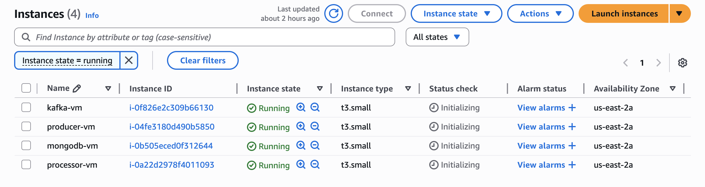
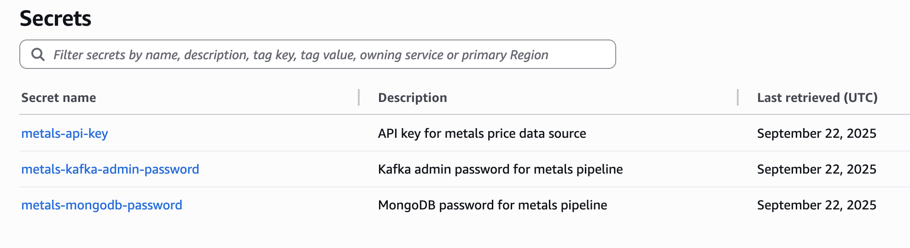

# CA1 - Metals Pipeline Infrastructure as Code

**Student:** Philip Eykamp  
**Course:** CS 5287  
**Project:** Infrastructure as Code (IaC) Implementation

## Overview

This project transforms a manual metals price processing pipeline into a fully automated Infrastructure as Code (IaC) deployment using Terraform and Ansible. The system processes metals pricing data through a distributed pipeline running on AWS, demonstrating enterprise-level DevOps automation practices.

## Prerequisites

### Required Tools and Versions
- **AWS CLI**: v2.x configured with valid credentials
- **Terraform**: v1.5+ (tested with Terraform v1.5.7)
- **Ansible**: v6.x+ (tested with ansible-core 2.15)
- **SSH Key Pair**: Created in AWS EC2 console
- **Python**: 3.8+ for local development (optional)

### AWS Credentials Setup
```bash
# Configure AWS CLI with your credentials
aws configure
# Enter: Access Key ID, Secret Access Key, Region (us-east-2), Output (json)

# Verify configuration
aws sts get-caller-identity
```

## Architecture

### Infrastructure Components
- **4 AWS EC2 Instances** (t3.small)
  - Kafka VM: Apache Kafka + Zookeeper for message streaming
  - MongoDB VM: Document database for processed data storage
  - Processor VM: Python application consuming from Kafka, writing to MongoDB
  - Producer VM: Python application publishing simulated metals pricing data

### Networking Design
- Custom VPC (10.0.0.0/16) with single public subnet (10.0.1.0/24)
- Internet Gateway for external connectivity
- Security groups restricting access to required ports only
- Private IP communication between services for optimal performance

### Security Implementation
- **Multi-Secret Management**: Three secrets stored in AWS Secrets Manager
  - MongoDB admin password
  - Kafka admin credentials
  - API key for external services
- SSH key-based authentication for all VM access
- No hardcoded credentials in any configuration files

## Deployment Instructions

### Single-Command Deployment
```bash
# Deploy complete infrastructure and applications
./deploy.sh
```

### Validation
```bash
# Check health endpoints (replace IPs with actual values from terraform output)
curl -s http://PRODUCER_IP:8000/health
curl -s http://PROCESSOR_IP:8001/health

# Expected: Both show "kafka_connected": true and "status": "healthy"
```

### Complete Cleanup
```bash
# Destroy all AWS resources
./destroy.sh
```

## Pipeline Validation Results

### Infrastructure Verification
The deployment creates 4 EC2 instances as shown in the AWS console:


*Four running t3.small instances (kafka-vm, producer-vm, mongodb-vm, processor-vm) in us-east-2a availability zone*

### Secrets Management Implementation
All credentials are securely managed through AWS Secrets Manager:


*Three secrets configured for comprehensive credential management: API key, Kafka admin password, and MongoDB password*

### Infrastructure Outputs
After successful deployment, the following endpoints are available:
- **Kafka Topic**: metals-prices (3 partitions)
- **MongoDB**: metals database with prices collection
- **Producer Health**: http://PRODUCER_IP:8000/health
- **Processor Health**: http://PROCESSOR_IP:8001/health

### Expected Health Response Format
```json
{
  "kafka_connected": true,
  "mongodb_status": "connected", 
  "status": "healthy",
  "processed_count": 0,
  "timestamp": "2025-09-22T02:56:48.712544"
}
```

### Data Flow Verification
1. Producer generates simulated metals pricing data
2. Kafka streams messages via metals-prices topic
3. Processor consumes messages and stores in MongoDB
4. Health endpoints confirm end-to-end connectivity

## Key Design Decisions

### Technology Choices
- **Terraform over CloudFormation**: Better cross-cloud portability and mature AWS provider
- **Ansible over Chef/Puppet**: Agentless architecture and YAML-based configuration
- **Local Terraform State**: Due to S3 bucket creation permission restrictions in educational AWS environment
- **Docker Containerization**: Ensures consistent application deployment across environments

### Security Approach
- **AWS Secrets Manager over environment variables**: Centralized secret management with rotation capabilities
- **Multiple secrets implementation**: Demonstrates comprehensive credential management beyond minimum requirements
- **Placeholder API keys**: Educational environment using simulated data rather than external API costs

### Network Architecture
- **Single AZ deployment**: Simplified for educational purposes while maintaining production patterns
- **Docker networks for Kafka**: Solves container communication issues with dedicated bridge network
- **Public IPs for monitoring**: Enables external health checks while maintaining private internal communication

### Ansible Inventory Management
- **Manual IP updates required**: Educational trade-off between automation complexity and learning objectives
- **Static inventory over dynamic**: Avoids additional AWS permissions and complexity for assignment scope

## Manual Configuration Steps

Due to educational AWS environment limitations, the following manual steps are required:

### 1. SSH Key Configuration
```bash
# Update terraform/terraform.tfvars with your key name
echo 'ssh_key_name = "your-actual-key-name"' > terraform/terraform.tfvars
```

### 2. Ansible Inventory Updates
After each deployment, update `ansible/inventory/hosts.yml` with new IP addresses from `terraform output`.

### 3. Kafka Networking Fix
If health endpoints show `kafka_connected: false`, run the Kafka container restart sequence:
```bash
cd ansible/
# Container restart with proper Docker networking (commands in troubleshooting section)
```

## Project Structure

```
ca1-metals/
├── deploy.sh                 # Main deployment automation
├── destroy.sh               # Infrastructure cleanup
├── README.md                # This documentation
├── documentation/           # Deployment evidence
│   └── sample-deployment-log.txt
├── terraform/               # Infrastructure as Code
│   ├── main.tf             # AWS resource definitions
│   ├── variables.tf        # Input parameters
│   ├── outputs.tf          # Resource outputs
│   └── versions.tf         # Provider requirements
├── ansible/                 # Configuration management
│   ├── quickdeploy.yml     # Complete deployment playbook
│   ├── inventory/
│   │   └── hosts.yml       # VM inventory (updated per deployment)
│   ├── producer/           # Producer application code
│   │   ├── Dockerfile
│   │   ├── producer.py
│   │   └── requirements.txt
│   └── processor/          # Processor application code
│       ├── Dockerfile
│       ├── processor.py
│       └── requirements.txt
└── scripts/
    └── quick-test.sh       # Pipeline validation tools
```

## Troubleshooting Guide

### Common Issues and Solutions

#### SSH Connection Timeouts
```bash
# Verify SSH key permissions
chmod 400 ~/.ssh/your-key.pem

# Update Ansible inventory with new IPs after each deployment
# Get new IPs: cd terraform && terraform output
```

#### Kafka Connectivity Issues (`kafka_connected: false`)
```bash
cd ansible/
# Restart Kafka with proper Docker networking
ansible -i inventory/hosts.yml kafka -m shell -a "docker stop kafka zookeeper || true"
ansible -i inventory/hosts.yml kafka -m shell -a "docker rm kafka zookeeper || true"
ansible -i inventory/hosts.yml kafka -m shell -a "docker network create kafka-network"
ansible -i inventory/hosts.yml kafka -m shell -a "docker run -d --name zookeeper --network kafka-network -p 2181:2181 -e ZOOKEEPER_CLIENT_PORT=2181 -e ZOOKEEPER_TICK_TIME=2000 confluentinc/cp-zookeeper:7.4.0"
sleep 45
ansible -i inventory/hosts.yml kafka -m shell -a "docker run -d --name kafka --network kafka-network -p 9092:9092 -e KAFKA_BROKER_ID=1 -e KAFKA_ZOOKEEPER_CONNECT=zookeeper:2181 -e KAFKA_ADVERTISED_LISTENERS=PLAINTEXT://localhost:9092 -e KAFKA_OFFSETS_TOPIC_REPLICATION_FACTOR=1 confluentinc/cp-kafka:7.4.0"
```

#### Container Status Verification
```bash
# Check all containers across VMs
ansible -i inventory/hosts.yml all -m shell -a "docker ps"

# View application logs
ansible -i inventory/hosts.yml producer -m shell -a "docker logs metals-producer"
ansible -i inventory/hosts.yml processor -m shell -a "docker logs metals-processor"
```

## Deviations from CA0

### Automation Enhancements
- **Single-command deployment** replaces manual VM provisioning and configuration
- **Secrets management** replaces hardcoded credentials
- **Health monitoring** provides automated validation of pipeline status
- **Infrastructure as Code** ensures reproducible deployments

### Architecture Simplifications
- **Simulated data source** instead of external API integration (educational focus)
- **Single AZ deployment** for reduced complexity while maintaining core patterns
- **Local Terraform state** due to educational AWS permission constraints

### Security Improvements
- **AWS Secrets Manager integration** for credential management
- **No secrets in version control** through proper .gitignore configuration
- **SSH key authentication** for all infrastructure access

## Known Limitations

### Infrastructure State Management
This implementation uses local Terraform state due to AWS IAM permission restrictions in the educational environment. Production deployment would use:
```hcl
terraform {
  backend "s3" {
    bucket = "terraform-state-bucket"
    key    = "ca1/terraform.tfstate"
    region = "us-east-2"
  }
}
```

### Manual Steps Required
- SSH key configuration in terraform.tfvars
- Ansible inventory IP updates after each deployment
- Kafka networking fix for container communication (known Docker issue)

### Educational Trade-offs
- Single availability zone for simplicity
- Placeholder API keys instead of external service integration
- Manual inventory management to focus on core IaC concepts

## Deployment Evidence

Complete deployment logs demonstrating successful infrastructure provisioning, application deployment, and pipeline validation are available in `documentation/sample-deployment-log.txt`.

The log shows:
- Successful secret retrieval from AWS Secrets Manager
- Terraform infrastructure provisioning with idempotent behavior
- Ansible application deployment across all 4 VMs
- Health endpoint validation confirming operational pipeline

## License

This project is for educational purposes as part of CS 5287 coursework.